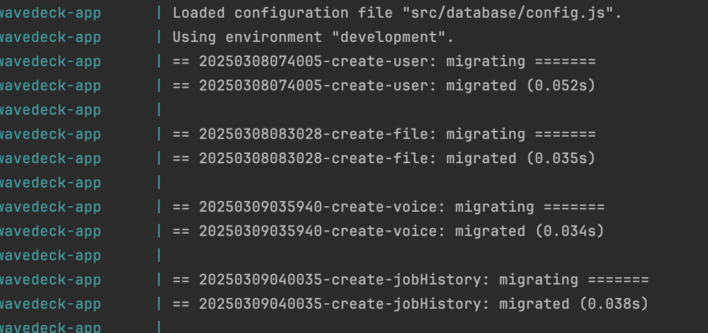
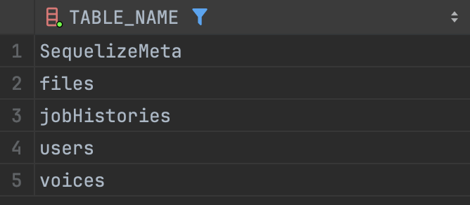
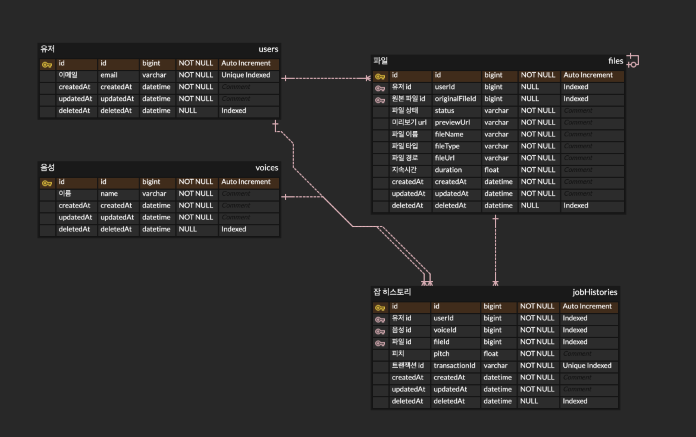

### 프로젝트 소개

해당 어플리케이션 서버는 크게 아래 두가지 기능을 수행합니다.

1. 사용자로부터 음성 파일을 업로드 받고, 파일을 저장합니다.
2. 업로드 받은 음성 파일을 AI 서버로 sts 변환을 요청합니다.

### 사용 기술

- nodejs
- express
- mysql
- sequelize
- BullMQ
- typescript
  - 타입 지원을 통해, 코드 안정성과 유지보수성 향상을 위해 적용
- husky
  - git hooks를 활용해 코드 품질 유지 및 자동화
- pm2
  - backoff 기능을 통한 서버 가용성 향상
  - 멀티 프로세스 활용 - cluster mode (싱글 스레드 단점 극복)
  - 그외에 모니터링, 로그 관리 등과 같은 서버 운영에 유용한 기능들을 활용하기 위함

### 실행 방법

- 어플리케이션 서버 실행을 위해서는 로컬 머신에 `docker`, `docker-compose` 설치가 선행되어야합니다.<br/>
- 프로젝트 실행 및 셋업에 필요한 환경변수는 디폴트로 설정되어 있습니다. <br/>
  환경 변수 변경이 필요한 경우.env.sample을 참고해주시면 됩니다. <br/>
- 서버는 개발 환경 기준으로 실행되며, 프로덕션 환경 기준의 셋업도 별도로 분리해 추가해둔 상태입니다. <br/>
  - dev: Dockerfile.dev, ecosystem.dev.config.js
  - prd: Dockerfile.prd, ecosystem.config.js

1. `docker compose up --build`
   - mysql, redis, nodejs 환경을 셋업합니다.
   - express 서버 실행을 위해 의존성들을 설치합니다 (npm install)
   - 데이터베이스 마이그레이션을 실행합니다.
   - 개발 환경의 경우, 서버 실행시 초기 seed 데이터가 추가됩니다.
   - pm2 기반으로 어플리케이션 서버, BullMQ 기반의 워커 프로세스를 실행합니다.

### 데이터베이스 셋업

- `docker compose up --build` 실행 시 데이터베이스 셋업, 마이그레이션 및 초기 시드데이터 추가까지 모두 실행됩니다. <br/> 필요 시 아래 커맨드들을 활용하는 것 또한 가능합니다.
  - npm run migrate (마이그레이션 실행)
    - 
  - npm run seed (시드 데이터 추가)
  - 샘플 쿼리
    ```sql
    SELECT TABLE_NAME
      FROM information_schema.tables
      where TABLE_SCHEMA='wavedeck-development'
    ```
    

### 테스트 실행

통합테스트를 위한 테스트용 DB가 세팅되어야합니다.<br />
테스트 편의성을 위해 개발환경, 테스트 환경 모두 하나의 `docker-compose.yml`로 관리하고 있습니다.

1. `docker compose up --build`
2. `npm run test`

### 프로젝트 구조

- common
  - 공통적으로 사용되는 유틸리티 함수를 모아둔 폴더입니다.
- controllers
  - API 요청을 처리하는 컨트롤러 함수들이 포함된 폴더입니다.
  - 요청을 받아 models에 정의된 비즈니스 로직을 실행하고, 응답을 반환합니다.
- database
  - 데이터베이스 연결 및 ORM 설정이 포함된 폴더입니다.
  - 마이그레이션 파일, 시드 데이터, 데이터베이스 설정 등이 존재합니다..
- errors
  - 커스텀 에러 클래스 및 어플리케이션 전반에서 사용할 에러 핸들링 관련 코드가 포함된 폴더입니다.
- external
  - 외부 API 및 외부 서비스 연동을 위한 모듈들이 포함된 폴더입니다.
- jobs
  - BullMQ와 같은 큐를 활용한 비동기 작업들의 대한 설정 및 관련 로직이 포함된 폴더입니다.
- logger
  - winston, morgan 기반의 로그 관련 설정이 정의되어 있는 폴더입니다.
- middlewares
  - express에서 실행되는 미들웨어 함수들이 포함된 폴더입니다.
- models
  - 데이터베이스 모델과 비즈니스 로직이 함께 정의된 폴더입니다.
  - Active Record 패턴을 사용하여, 각 모델 클래스 내부에 비즈니스 로직이 포함됩니다.
- routes
  - 어플리케이션 라우팅 설정이 포함된 폴더입니다.
- test
  - 테스트 코드가 포함된 폴더입니다. 유닛 테스트, 통합 테스트 및 테스트 관련 설정 파일이 포함되어 있습니다.
- types
  - 타입스크립트 타입 정의 및 커스텀 타입이 정의되어 있는 폴더입니다.

### 데이터 모델



### 구현 과정

1. express 셋업
   - controllers, models, routes 등 어플리케이션 서버 동작에 필요한 구성요소들을 셋업합니다.
   - transactionIdMiddleware를 통해 모든 요청들에 대해서 고유한 transactionId를 부여합니다. 해당 값은 서버로 들어오는 요청들을 구분하는 구분자입니다.
2. 에러 핸들러 셋업
   - 어플리케이션 서버 내 발생 가능한 에러들을 핸들링 하기위한 에러 및 메시지들을 정의합니다.
   - 글로벌 에러 핸들러를 통해 에러를 핸들링합니다.
3. database 셋업
   - MySQL 기반의 데이터베이스 셋업 및 Sequelize를 활용해 데이터베이스와의 상호작용합니다.
   - 데이터베이스와 어플리케이션 간의 상호작용을 위한 models를 정의합니다.
   - Active Record 패턴을 활용하였습니다. 모델 클래스에서 데이터 정의 뿐만 아니라 비즈니스 로직도 함께 정의합니다.
4. 코드 퀄리티 관리
   - eslint, prettier를 사용하여 코드 린트 및 포맷팅은 실행합니다.
   - husky를 활용하여 git pre-commit 동작으로 eslint를 통한 코드 검증을 진행합니다.
5. logger 셋업
   - winston, winston daily rotate file의 조합으로 일별 서버 로그를 기록하도록 합니다.
   - morgan 라이브러리를 통해 http 요청에 대한 로그를 winston logger로 스트림 하도록 처리하였습니다.
   - 현재는 로그 파일을 로컬에 저장하는 구조입니다. 이렇게 구성한 경우 디스크 용량 이슈가 발생할 수 있어, 실제 프로덕션에서는 클라우드 환경에 저장되는 방향으로 개선을 해볼수 있을 것 같습니다.
6. 테스트 환경 셋업
   - 테스트 프레임워크로 jest를 활용합니다.
   - factory 기능을 만들어 테스트 수행에 필요한 데이터를 빠르게 생성할 수 있도록 합니다.
   - 통합테스트, 유닛테스트를 활용하여 models, controller 코드를 테스트합니다.
7. API 구현
   - 요구 사항들을 기반으로 API를 구현합니다.
   - 클라이언트로부터 http 요청을 받아 컨트롤러 <-> 모델 코드와의 상호 작용을 통해 동작을 처리한 후, 응답 값을 반환합니다.
   - 작성한 API들이 요구사항에 맞게 동작을 하는지 테스트 코드를 통해 검증합니다.
8. CI 구성
   - github action을 활용해 CI 파이프라인을 구성합니다.
   - ci.yml에 정의한 workflow의 과정을 수행합니다. (lint, test)
9. 큐 시스템
   - BullMQ 라이브러리를 사용하여 비동기 작업을 처리하기 위한 큐 기반의 시스템을 추가하였습니다.
   - concurrency 옵션을 통해서 워커의 동시 처리 가능한 job의 수를 제어하며, pm2 cluster 모드를 활용하여 워커 인스턴스를 확장할 수 있는 형태로 구성하였습니다.
   - 큐 상태, 수행 및 대기, 실패 등에 대한 비동기 작업들의 대한 생명주기 정보는 별도의 대시보드 페이지를 통해 확인이 가능합니다.
     - 대시보드 페이지
       - `'/admin/queues/dashboard'`
     - 큐 상태조회 api
       - `'/admin/queues/status'`

## API docs

**Postman에서 `Wavedeck.postman_collection.json`을 import하여 빠르게 API 테스트 및 응답 값 확인이 가능합니다.**

### # 파일 업로드

**Endpoint**: `/api/vi/common/upload/audio`

**Method**: POST

**form-data**

- file
- userId (optional)

**Request example**

```http request
POST /api/vi/common/upload/audio
```

### # 파일 삭제

**Endpoint**: `/api/v1/common/upload/audio/1`

**Method**: DELETE

**Request Params**

- fileId

**Request Body**

- userId

**Request example**

```http request
DELETE /api/v1/common/upload/audio/1
```

### # STS 변환 요청

**Endpoint**: `/api/v1/inference/sts`

**Method**: POST

**Request Body**

- userId
- fileId
- voiceId
- pitch

**Request example**

```http request
POST /api/v1/inference/sts
```

### # 큐 상태 조회

**Endpoint**: `/admin/queues/status`

**Method**: GET

**Request example**

```http request
GET /admin/queues/status
```
